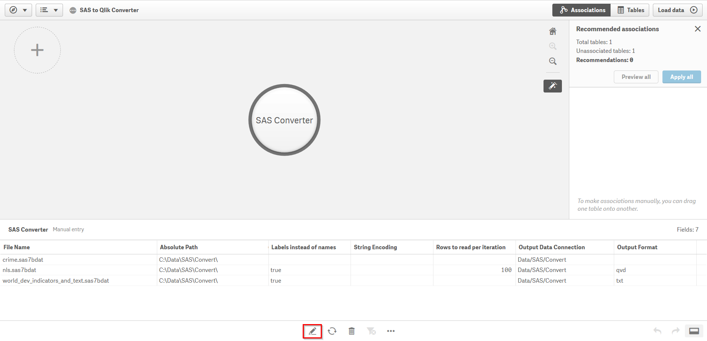
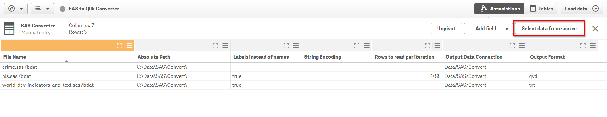
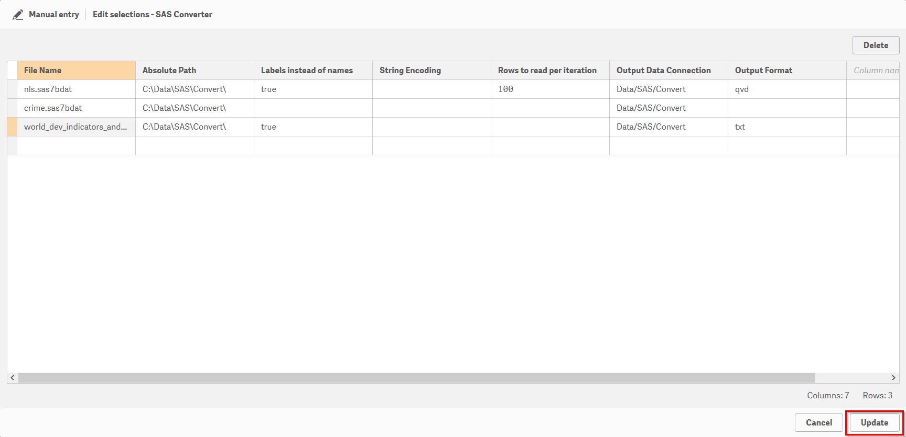
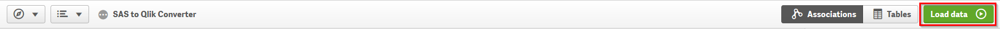

# Load SAS Datasets into Qlik

## Table of Contents

- [Introduction](#introduction)
- [Pre-requisites](#pre-requisites)
- [Installation](#installation)
- [SAS to Qlik Converter App](#sas-to-qlik-converter-app)
- [Usage through the Qilk Load Script](#usage-through-the-qlik-load-script)

## Introduction
This Python Server Side Extension (SSE) for Qlik helps load SAS datasets stored in SAS7BDAT or XPORT files.

The files are read using the [Pandas library](https://pandas.pydata.org/pandas-docs/stable/io.html?highlight=sas7bdatreader#sas-formats) and the [sas7bdat module](https://bitbucket.org/jaredhobbs/sas7bdat/overview).

For more information on Qlik Server Side Extensions see [qlik-oss](https://github.com/qlik-oss/server-side-extension).

**Disclaimer:** This project has been started by me in a personal capacity and is not supported by Qlik. 

## Pre-requisites

- Qlik Sense Enterprise or Qlik Sense Desktop
- Python 3.6.7

## Installation

For installing this SSE on a machine without Internet access, use the instructions [here](offline-install/README.md).

1. Get Python from [here](https://www.python.org/downloads/). Remember to select the option to add Python to your PATH environment variable.

2. Download the [latest release](https://github.com/nabeel-qlik/qlik-sas-reader/releases/) for this SSE and extract it to a location of your choice. The machine where you are placing this repository should have access to a local or remote Qlik Sense instance.

3. Right click `Qlik-SAS-Init.bat` and choose 'Run as Administrator'. You can open this file in a text editor to review the commands that will be executed. If everything goes smoothly you will see a Python virtual environment being set up, project files being copied, some packages being installed and TCP Port 50056 being opened for inbound communication. 
    - Note that the script always ends with a "All done" message and does not check for errors.
    - If you need to change the port you can do so in the file `core\__main__.py` by opening the file with a text editor, changing the value of the `_DEFAULT_PORT` variable, and then saving the file. You will also need to update `Qlik-Py-Init.bat` to use the same port in the `netsh` command. This command will only work if you run the batch file through an elevated command prompt (i.e. with administrator privileges).
    - Once the execution completes, do a quick scan of the log to see everything installed correctly. The libraries imported are: `grpcio`, `grpcio-tools`, `numpy`, `pandas`, `sas7bdat` and their dependencies. Also, check that the `core` and `generated` directories have been copied successfully to the newly created `qlik-sas-env` directory.

4. Now whenever you want to start this Python service you can run `Qlik-SAS-Start.bat`. You may need to run this batch file as an administrator.

5. Now you need to [set up an Analytics Connection in Qlik Sense Enterprise](https://help.qlik.com/en-US/sense/February2018/Subsystems/ManagementConsole/Content/create-analytic-connection.htm) or [update the Settings.ini file in Qlik Sense Desktop](https://help.qlik.com/en-US/sense/February2018/Subsystems/Hub/Content/Introduction/configure-analytic-connection-desktop.htm).

6. Finally restart the Qlik Sense engine service for Qlik Sense Enterprise or close and reopen Qlik Sense Desktop. This step may not be required if you are using Qlik Sense April 2018 or above.

7. Download the [SAS to Qlik Converter app](docs/SAS-to-Qlik-Converter.qvf) and import it in Qlik Sense.

## SAS to Qlik Converter App

Once this SSE is running you can use the [SAS to Qlik Converter app](docs/SAS-to-Qlik-Converter.qvf) to convert SAS7BDAT files to QVD or CSV formats. You can convert multiple files at a time, and with Qlik Sense Enterprise, schedule a reload task to run the conversion as a background job.

Open the Data Manager in the app and edit the *SAS Converter* table.



Now click on *Select data from source*. 



This is a manual entry table and can be modified within the app. You can also copy and paste text using `Ctrl+C` and `Ctrl+V` in Windows.



You need to provide information on the files to be converted using this table. The fields in **Bold** are mandatory.

| Field | Description | Sample Values | Remarks |
| --- | --- | --- | --- |
| **File Name** | The file name including the extension | `abc.sas7bdat` | The converter app is only meant for use with SAS7BDAT files. |
| **Absolute Path** | Absolute path to the file | `C:/SAS` | This path is with reference to the Server-Side Extension and cannot be a Qlik Data Connection. Shared drives will work as long as the user running the SSE has access to the directory. |
| Labels instead of names | Use labels rather than the variable names in SAS | `true`, `false` | This option will fetch the label attribute for the variables in the SAS file and rename the fields in Qlik accordingly. |
| String encoding | Codec to be used for decoding text data | `utf_8` | If this field is left blank, the SSE will attempt to decode with `utf_8`, `ascii` and `latin_1`, but in case of issues will return the text as bytes.<br><br>If the encoding is unknown and default decoding fails, the data can be cleaned up in Qlik using [String functions](https://help.qlik.com/en-US/sense/November2018/Subsystems/Hub/Content/Sense_Hub/Scripting/StringFunctions/string-functions.htm).<br><br>Valid values for this field are any of the [standard encodings in Python](https://docs.python.org/3/library/codecs.html#standard-encodings) |
| Rows to read per iteration | Chunk size for reading rows from the file | `1000` | The file is read iteratively, `chunksize` lines at a time. This parameter defaults to `1000` but may be adjusted based on the number of rows and columns in the file. |
| **Output Data Connection** | Existing Folder Data Connection in Qlik for storing the converted file | `Data`, `Data/SAS/Converted` | Valid values are an existing folder data connection in Qlik, or a subdirectory within an existing folder data connection. Do not include the `lib://` string. |
| Output Format | The format for the converted file | `qvd`, `csv`, `txt` | If this field is left blank, the file will be saved in the `qvd` format. |

Once the *SAS Converter* table is updated you can convert the files by clicking Load. You will need to do this through the Load Script Editor to be able to see any error messages.



## Usage through the Qilk Load Script

This SSE can be used through the Qlik Sense Load Editor using the [LOAD...EXTENSION](https://help.qlik.com/en-US/sense/November2018/Subsystems/Hub/Content/Sense_Hub/Scripting/ScriptRegularStatements/Load.htm) syntax. 

First you need to specify the path for the file and any additional arguments. We do this by creating a temporary input table in Qlik.

```
TempInputs:
LOAD * INLINE [
     'Path', 'Args'
     '..\..\data\sample.sas7bdat', 'debug=true, labels=true'
];
```

In the example above the SAS7BDAT file has been placed in a subfolder called 'data' in the root directory of this SSE. You can also use absolute paths.

The data can then be loaded using the `LOAD...EXTENSION` syntax using the Read_SAS function provided by this SSE:

```
[SAS Dataset]:
LOAD *
EXTENSION SAS.Read_SAS(TempInputs{Path, Args});
```

In the example above the analytic connection has been named as `SAS`. This will depend on how you named the connection in step 5 of the installation.

If you want a preview of the data, you can use the `debug=true` argument. This will enable the logging features of the SSE with information printed to the terminal and a log file. The log files can be found in the `qlik-sas-reader\qlik-sas-env\core\logs\` directory. 

For large files you should consider passing the `chunksize` parameter. This allows the file to be read iteratively `chunksize` lines at a time. This parameter defaults to `1000` for this SSE, but may need to be adjusted based on the number of columns in the file. 

The optional parameters below can be included in the additional arguments passed to the function.  

| Keyword | Description | Sample Values | Remarks |
| --- | --- | --- | --- |
| debug | Flag to output additional information to the terminal and logs | `true`, `false` | Information will be printed to the terminal and a log file: `..\qlik-sas-env\core\logs\SAS Reader Log <n>.txt`. <br/><br/>Particularly useful is looking at the sample output to see how the file is structured. |
| labels | Flag to return labels instead of variable names from the SAS file | `true`, `false` | This parameter defaults to `false`. <br/><br/>For very wide tables, the labels may exceed metadata limits. In this case you can use the `Get_Labels` function described below. |
| format | The format of the file | `xport`, `sas7bdat` | If the format is not specified, it will be inferred. |
| encoding | Codec to be used for decoding text data | `utf_8` | Valid values are any of the [standard encodings in Python](https://docs.python.org/3/library/codecs.html#standard-encodings).<br><br>If the encoding is not specified, Pandas returns the text as raw bytes. This SSE will attempt to decode with `utf_8`, `ascii` and `latin_1`, but in case of issues will return the text as bytes.<br><br>If the encoding is unknown and default decoding fails, the data can be cleaned up in Qlik using [String functions](https://help.qlik.com/en-US/sense/November2018/Subsystems/Hub/Content/Sense_Hub/Scripting/StringFunctions/string-functions.htm). |
| chunksize | Read file chunksize lines at a time | `1000` | The file is read iteratively, `chunksize` lines at a time. This parameter defaults to `1000` but may need to be adjusted based on the number of columns in the file. |

To get labels for the variables in a SAS7BDAT file you can call the `Get_Labels` function. If you load the result from this function as a mapping table in Qlik, you can easily rename the field names using the [Rename Fields](https://help.qlik.com/en-US/sense/November2018/Subsystems/Hub/Content/Sense_Hub/Scripting/ScriptRegularStatements/rename-field.htm) script function.

```
TempInputs:
LOAD * INLINE [
     'Path', 'Args'
     '..\..\data\sample.sas7bdat', ''
];

[SAS Dataset]:
LOAD *
EXTENSION SAS.Read_SAS(TempInputs{Path, Args});

FieldMap:
MAPPING LOAD *
EXTENSION SAS.Get_Labels(TempInputs{Path, Args});

Rename Fields using FieldMap;

Drop table TempInputs;
```